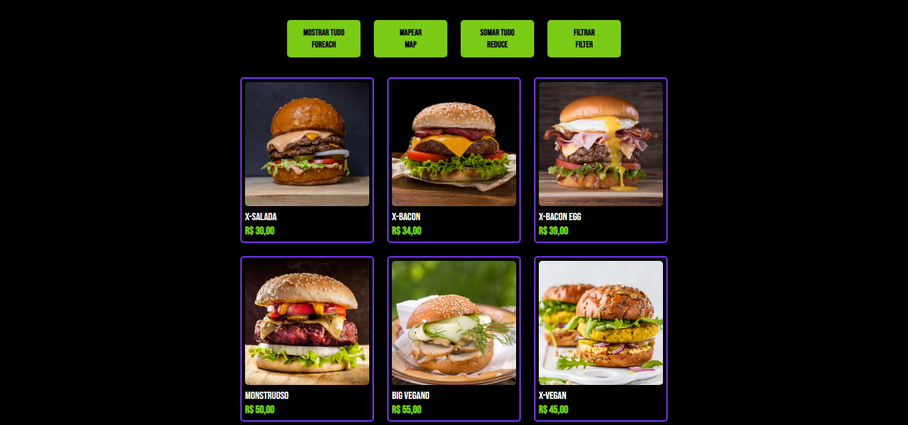

# Food Menu App 🍔🍟

Este repositório apresenta um aplicativo web simples para exibir um cardápio de alimentos com várias funcionalidades, utilizando HTML, CSS e JavaScript. O aplicativo permite que os usuários interajam com os itens do cardápio por meio de diferentes botões, como exibir todos os itens, aplicar um desconto, calcular o valor total e filtrar opções veganas.

## Funcionalidades 🍽️🛒

- **Mostrar Todos os Itens**: Clicar no botão "Mostrar tudo" exibe todos os itens do cardápio, incluindo imagens, nomes e preços.

- **Mapear Todos os Itens**: Clicar no botão "Mapear" aplica um desconto de 10% a todos os preços dos itens usando a função `map` e exibe os preços atualizados.

- **Somar Todos os Itens**: Clicar no botão "Somar tudo" calcula e exibe o valor total de todos os itens do cardápio.

- **Filtrar Itens Veganos**: Clicar no botão "Filtrar" exibe apenas os itens veganos do cardápio.

## Como Usar 🍴🖱️

1. Clone o repositório para sua máquina local.
2. Abra o arquivo `index.html` em seu navegador.

## Tecnologias Utilizadas 🌐💻

- HTML
- CSS
- JavaScript

## Visualização

## Licença 📄

Este projeto está licenciado sob a [Licença MIT](LICENSE).

Sinta-se à vontade para explorar o código e aprimorar o aplicativo de acordo com suas necessidades. Se tiver sugestões ou encontrar problemas, abra uma [issue](https://github.com/paulo-santos360/Javascript-Productsissues). Contribuições são bem-vindas!
